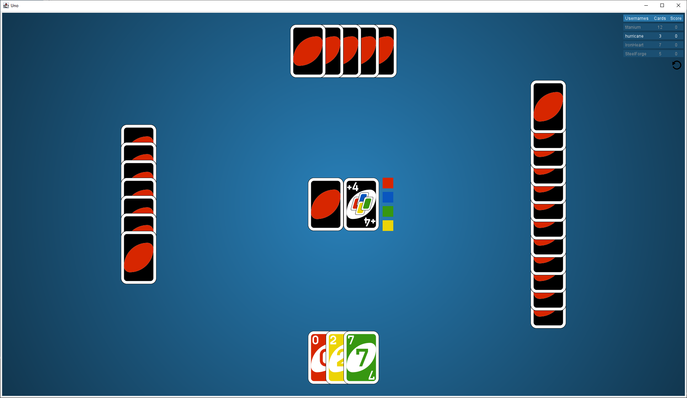
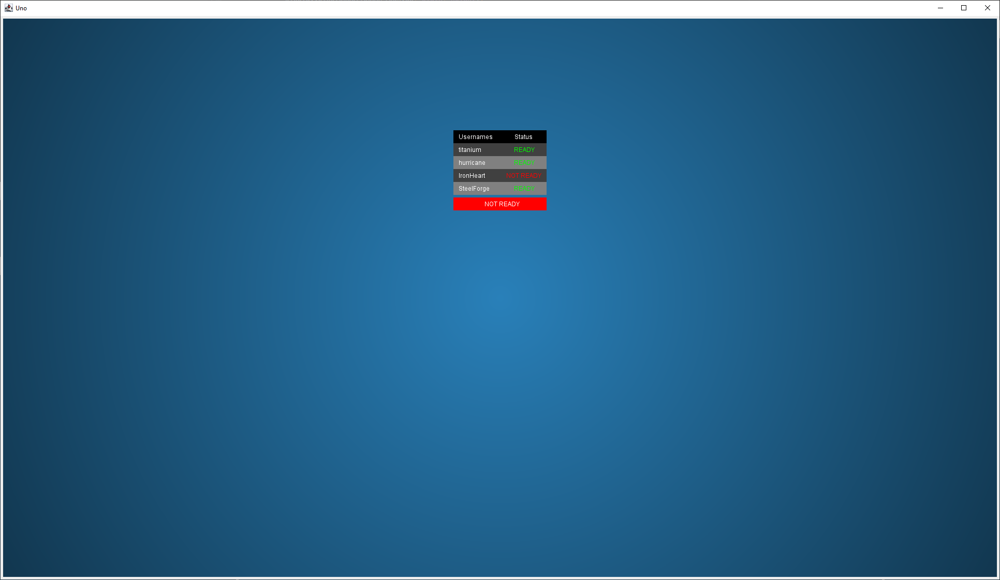
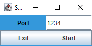

# Uno

Uno is implementation of the game Uno in Java. 

## Features
- GUI interface
- Multiplayer (4 Player)
- Customer Username
- Game Reset
- Multithreading (Game Logic and Network Communication)
- Server Hosting (Customizable Port)

## Images

### Game Session

### Server Menu

### Server Lobby

### Server Config

## Prerequisites
- Java 11
- Swing
- AWT
- Socket

## Creators
Tommy Pham
Tyrus Karmesin